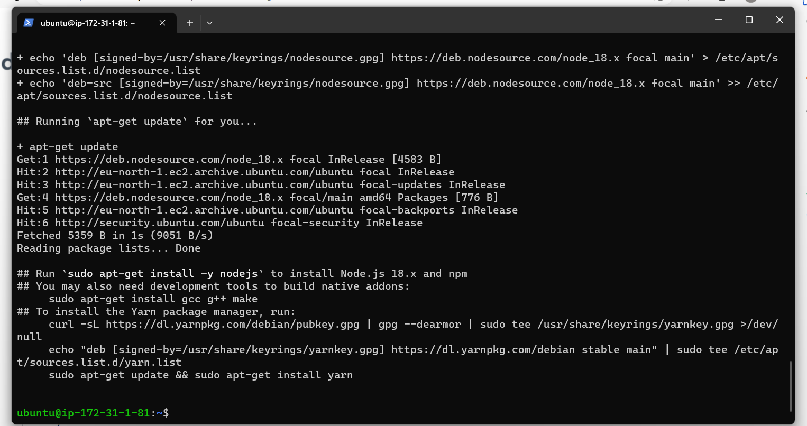

## SIMPLE TO-DO APPLICATION ON MERN WEB STACK

Connecting to EC2 using Windows Terminal

#### Step 1 

*BACKEND CONFIGURATION*

*Update Ubuntu*

 `sudo apt update`.

*Upgrade Ubuntu*

`sudo apt upgrade`.

*Get the location of Node.js software from Ubuntu repositories.*

`curl -fsSL https://deb.nodesource.com/setup_18.x | sudo -E bash -`.

*Installing Node.js*

`sudo apt-get install -y nodejs`.

*Verify the node installation*

`node -v`.

`npm -v`.

*Application Code Setup*

*Create a new directory To-Do*

`mkdir Todo`.

*Initialise project, so that a new file named package.json will be created*

`npm init`.

*Installing ExpressJs*

`npm install express`.

*create a file index.js*

`touch index.js`.

*Install the dotenv module*

`npm install dotenv`.

*Open the index.js file*

`vim index.js`.

*Paste the code into the file*

`const express = require('express');
require('dotenv').config();

const app = express();

const port = process.env.PORT || 5000;

app.use((req, res, next) => {
res.header("Access-Control-Allow-Origin", "\*");
res.header("Access-Control-Allow-Headers", "Origin, X-Requested-With, Content-Type, Accept");
next();
});

app.use((req, res, next) => {
res.send('Welcome to Express');
});

app.listen(port, () => {
console.log(`Server running on port ${port}`)
});`.

 *Start our server*

 `node index.js`.

*Create a folder routes*

 `mkdir routes`.

  `cd routes`.

*Create a file api.js*

`touch api.js`.

**Open the file**

 `vim api.js`.

**Copy below code in the file**

`const express = require ('express');
const router = express.Router();

router.get('/todos', (req, res, next) => {

});

router.post('/todos', (req, res, next) => {

});

router.delete('/todos/:id', (req, res, next) => {

})

module.exports = router;`.

**Create a Schema and a model, install mongoose which is a Node.js package that makes working with mongodb easier**

**Change directory back Todo folder**

`cd Todo`

`npm install mongoose`

`mkdir models`

`cd models`

**Create a file todo.js**

`touch todo.js`

**Open the file created with vim todo.js then paste the code below in the file**

`const mongoose = require('mongoose');
const Schema = mongoose.Schema;

//create schema for todo
const TodoSchema = new Schema({
action: {
type: String,
required: [true, 'The todo text field is required']
}
})

//create model for todo
const Todo = mongoose.model('todo', TodoSchema);

module.exports = Todo;`

**Updating api.js in routes directory**

`vim api.js`

**Update with the below codes**

`const express = require ('express');
const router = express.Router();
const Todo = require('../models/todo');

router.get('/todos', (req, res, next) => {

//this will return all the data, exposing only the id and action field to the client
Todo.find({}, 'action')
.then(data => res.json(data))
.catch(next)
});

router.post('/todos', (req, res, next) => {
if(req.body.action){
Todo.create(req.body)
.then(data => res.json(data))
.catch(next)
}else {
res.json({
error: "The input field is empty"
})
}
});

router.delete('/todos/:id', (req, res, next) => {
Todo.findOneAndDelete({"_id": req.params.id})
.then(data => res.json(data))
.catch(next)
})

module.exports = router;`

**Change directory back Todo folder with cd .. and install Mongoose**

`npm install mongoose`

**Create a new folder models**

`mkdir models`

**Change directory into the newly created ‘models’**

`cd models`

**Inside the models folder, create a file and name it todo.js**

`touch todo.js`

**Open the file created with vim todo.js then paste the code below in the file**

`const mongoose = require('mongoose');
const Schema = mongoose.Schema;

//create schema for todo
const TodoSchema = new Schema({
action: {
type: String,
required: [true, 'The todo text field is required']
}
})

//create model for todo
const Todo = mongoose.model('todo', TodoSchema);

module.exports = Todo;`

 **update our routes from the file api.js in ‘routes’ directory**

 ` vim api.js`

 **Paste the code below in the file**

 ` const express = require ('express');
const router = express.Router();
const Todo = require('../models/todo');

router.get('/todos', (req, res, next) => {

//this will return all the data, exposing only the id and action field to the client
Todo.find({}, 'action')
.then(data => res.json(data))
.catch(next)
});

router.post('/todos', (req, res, next) => {
if(req.body.action){
Todo.create(req.body)
.then(data => res.json(data))
.catch(next)
}else {
res.json({
error: "The input field is empty"
})
}
});

router.delete('/todos/:id', (req, res, next) => {
Todo.findOneAndDelete({"_id": req.params.id})
.then(data => res.json(data))
.catch(next)
})`

**MongoDB Database**

**Create a file .env in your Todo directory**

` touch .env`

**Add the connection string to access the database in it**

` vi .env`

**Then paste the connection string**

DB ='mongodb+srv://olanrewajusofela:<password>@olanrewaju.wnpostg.mongodb.net/?retryWrites=true&w=majority'

**Update index.js  to reflect the use of .env so that Node.js can connect to the database.**

**Open the file with vim index.js and delete existing code and replace with below codes**

`const express = require('express');
const bodyParser = require('body-parser');
const mongoose = require('mongoose');
const routes = require('./routes/api');
const path = require('path');
require('dotenv').config();

const app = express();

const port = process.env.PORT || 5000;

//connect to the database
mongoose.connect(process.env.DB, { useNewUrlParser: true, useUnifiedTopology: true })
.then(() => console.log(`Database connected successfully`))
.catch(err => console.log(err));

//since mongoose promise is depreciated, we overide it with node's promise
mongoose.Promise = global.Promise;

app.use((req, res, next) => {
res.header("Access-Control-Allow-Origin", "\*");
res.header("Access-Control-Allow-Headers", "Origin, X-Requested-With, Content-Type, Accept");
next();
});

app.use(bodyParser.json());

app.use('/api', routes);

app.use((err, req, res, next) => {
console.log(err);
next();
});

app.listen(port, () => {
console.log(`Server running on port ${port}`)
});`

**Start your server using the command in Todo directory**

`node index.js`

 